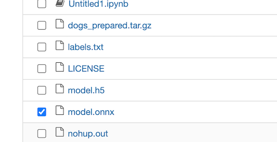
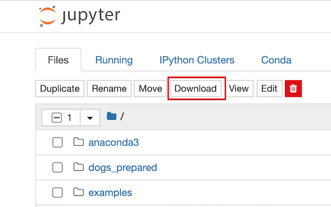
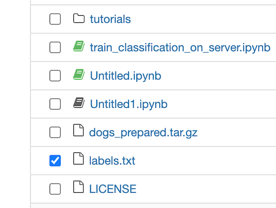
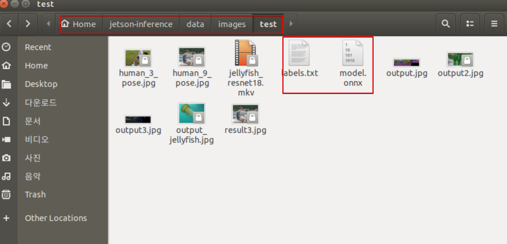

-----
# AWS 서버에서 물체 탐지 학습 - Jetson에 업로드와 분류 실행
<br><br><br><br>


# 커스텀 모델 업로드와 분류 실행

<br>

# 커스텀 모델 다운로드

Jetson에서 브라우저를 실행하고 할당된 AWS 서버로 접속한다.



파일 model.onnx를 체크하고 상단 '다운로드' 버튼을 클릭.




<br>

# 레이블링 데이터 다운로드

파일 labels.txt를 체크하고 상단 '다운로드' 버튼을 클릭.





<br>

# 파일 위치 이동

윈도우 탐색기(?)로 '다운로드' 폴더의 model.onnx와 labels.txt파일을 
Home > jetson-inference > data > images > test에 카피한다.




<br>

# 실행

터미널창을 열고 다음을 실행하여 도커를 실행.

```
$ cd ~/jetson-inference
$ docker/run.sh
```

다음을 실행.
```
$ cd build/aarch64/bin

$ cp images/test/model.onnx ./
$ cp images/test/labels.txt ./

$ ./imagenet-camera.py --model=model.onnx --labels=labels.txt --input_blob=model_input:0 --output_blob=model_output
```
