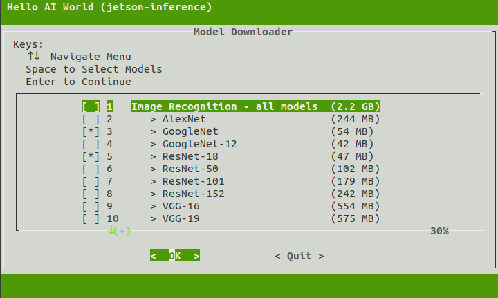

-----
# Jetson-Inference 프로젝트 설치 - 소스에서 빌드
<br><br><br><br>

# 소스에서 빌딩

https://github.com/dusty-nv/jetson-inference/blob/master/docs/building-repo-2.md 를 기반으로 함.

<br>

## 필요 프로그램, 라이브러리 설치

```bash
$ sudo apt-get update
$ sudo apt-get install git cmake libpython3-dev python3-numpy
```

<br>

## 프로젝트 다운로드

```bash
$ cd
$ git clone --recurse-submodules https://github.com/dusty-nv/jetson-inference
$ cd jetson-inference
```

<br>

## cmake 빌드

```bash
$ cd ~/jetson-inference
$ mkdir build
$ cd build
$ cmake ../
```

<br>

## 모델 다운로드

cmake가 종료되면 자동으로 다음이 실행된다.



다운로드 할 모델을 스페이스바 눌러서 선택하고 엔터 클릭하여 다운로드 실행.

수동으로 실행시키려면 다음을 실행.

```bash
$ cd ~/jetson-inference/tools
$ ./download-models.sh
```

<br>

## PyTorch 설치

다운로드 완료되면 다음이 자동으로 실행된다.


아래에 있는 'PyTorch v.1.4.0 for Python 3.6'에서 스페이스바 클릭, 엔터 클릭.

자동으로 실행되지 않으면 다음으로 실행시킨다.

```bash
$ cd ~/jetson-inference/build
$ ./install-pytorch.sh
```

<br>

## 컴파일/설치

```bash
$ make
$ sudo make install
$ sudo ldconfig
```

빌드된 것들이 aarch64/bin에 설치됨.

<br>

## 실행

파일 대상 분류

```bash
$ cd aarch64/bin
$ ./imagenet-console.py images/humans_0.jpg result.jpg
```

결과는 result.jpg로 저장된다. ubuntu의 윈도우 탐색기(?)로 확인 가능하다.


<br>

실시간 카메라 대상 분류

```bash
$ cd aarch64/bin
$ ./imagenet-camera.py 
```

윈도우 창이 뜨면서 실시간으로 분류 실행됨.

<br>

## build/aarch64/bin 밑의 파일 들

```bash
detectnet-camera.py  # detectnet.py와 동일. 카메라 동영상에 대해
detectnet-console.py # detectnet.py와 동일. 파일에 대해
detectnet.py         # 카메라 동영상 혹은 파일에 대해

imagenet-camera.py  # imagenet.py와 동일. 카메라 동영상에 대해
imagenet-console.py # imagenet.py와 동일. 파일에 대해
imagenet.py         # 카메라 동영상 혹은 파일에 대해

segnet-camera.py    # segnet.py와 동일
segnet-console.py   # segnet.py와 동일
segnet.py           # 카메라 동영상 혹은 파일에 대해

posenet.py          # 포즈 추출

video-viewer.py
caemra-viewr.py

my-detection.py     # object detection 코드 template
my-recognition.py   # classification 코드 template
```

<br>