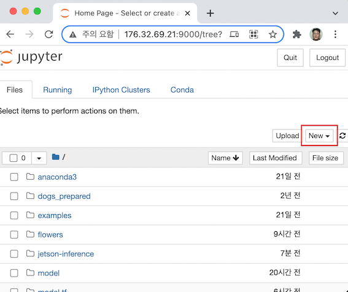
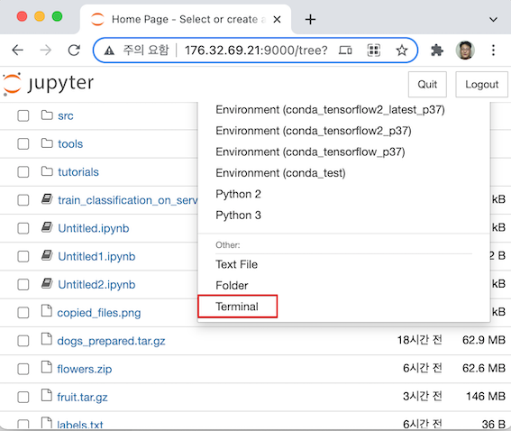
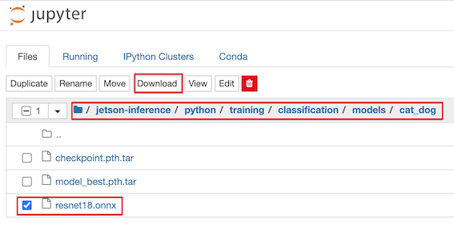

-----
# AWS 서버에서 분류 학습
<br><br><br><br>


# 환경 준비


## 서버 접속

각자 부여 받은 AWS의 jupyter로 접속. 본 문서에서는 http://176.32.69.21:9000 를 기준으로 한다.

상단 우측의 'new'를 클릭하고 'Terminal'을 선택


<br>



<br>

## Conda 실행

conda list에서 tensorflow2_p37 이름의 env가 있음을 확인
```
(python3) ubuntu@ip-172-31-19-226:~$ conda env list

# conda environments:#base                     /home/ubuntu/anaconda3
amazonei_mxnet_p36       /home/ubuntu/anaconda3/envs/amazonei_mxnet_p36aws_neuron_mxnet_p36     /home/ubuntu/anaconda3/envs/aws_neuron_mxnet_p36
aws_neuron_pytorch_p36     /home/ubuntu/anaconda3/envs/aws_neuron_pytorch_p36
aws_neuron_tensorflow_p36     /home/ubuntu/anaconda3/envs/aws_neuron_tensorflow_p36
mxnet_latest_p37         /home/ubuntu/anaconda3/envs/mxnet_latest_p37
mxnet_p36                /home/ubuntu/anaconda3/envs/mxnet_p36
python3               *  /home/ubuntu/anaconda3/envs/python3
pytorch_latest_p37       /home/ubuntu/anaconda3/envs/pytorch_latest_p37
pytorch_p37              /home/ubuntu/anaconda3/envs/pytorch_p37
tensorflow2_latest_p37     /home/ubuntu/anaconda3/envs/tensorflow2_latest_p37
tensorflow2_p37          /home/ubuntu/anaconda3/envs/tensorflow2_p37
tensorflow_p37           /home/ubuntu/anaconda3/envs/tensorflow_p37test                     /home/ubuntu/anaconda3/envs/test
```

conda activate로 환경에 들어간다.
```
(python3) ubuntu@ip-172-31-19-226:~$ conda activate pytorch_p37
(pytorch_p37) ubuntu@ip-172-31-19-226:~$
```

참고로 pytorch_p37에서 설치된 패키지는 [conda_env_pytorch_p37](conda_env_pytorch_p37)에서 볼 수 있다.


다음을 실행하여 pytorch 설치 확인
```
(pytorch_p37) ubuntu@ip-172-31-19-226:~$ python
Python 3.7.10 | packaged by conda-forge | (default, Feb 19 2021, 16:07:37)[GCC 9.3.0] on linux
Type "help", "copyright", "credits" or "license" for more information.
>>> import torch
>>> print(torch.__version__)
1.7.1
>>> exit()
```

<br>

## 프로젝트 다운로드

```bash
$ git clone --recurse-submodules https://github.com/dusty-nv/jetson-inference
$ cd jetson-inference
```

<br>


# 데이터 다운로드

```bash
$ cd ~/jetson-inference/python/training/classification/data
$ wget https://nvidia.box.com/shared/static/o577zd8yp3lmxf5zhm38svrbrv45am3y.gz -O cat_dog.tar.gz
$ tar xvzf cat_dog.tar.gz
```

파일 구조는 다음과 같다.

```bash
cat_dog/
	labels.txt
	train/
		cat/
		dog/
	val/
		cat/
		dog/
	test/
		cat/
		dog/
```

labels.txt의 내용은 다음과 같다.
```
cat
dog
```

<br>

# 학습

## 학습 실행

```bash
$ cd ~/jetson-inference/python/training/classification
$ python3 train.py --model-dir=models/cat_dog data/cat_dog --epochs=100 --lr=0.001
```

epoch 당 20초, 35 epoch에 12분 소여된다.

모델 저장 위치는 

```bash
~/jetson-inference/python/training/classification/
	models/cat_dog/
		checkpoint.pth.tar
		model_best.pth.tar
```

<br>

## ONNX 포멧으로 converting

```bash
$ python3 onnx_export.py --model-dir=models/cat_dog
```

~/jetson-inference/python/training/classification/models/cat_dog/ 아래에 

resnet18.onnx 파일이 생성된다.

<br>

# 분류 실행

## 모델 다운로드

이 아래는 Jetson에서 실행한다. [docker](setup_by_docker.md)환경을 사용함.

<br>

Jetson에서 웹브라우저를 실행하고 AWS 서버의 Jupyter에 접속한다.

jetson-inference / python / training / classification / models / cat_dog 로 이동.

resnet18.onnx를 체크.

상단의 'Download'를 클릭.



<br>

탐색기를 열어서 다운로드 위치의 resnet18.onnx를 

jetson-inference / python / training / classification / models / cat_dog 로 카피.

models/ 밑에 cat_dog 폴더를 만들고 카피해 준다.

<br>

## 데이터 다운로드

```bash
$ cd /jetson-inference/python/training/classification/data
$ wget https://nvidia.box.com/shared/static/o577zd8yp3lmxf5zhm38svrbrv45am3y.gz -O cat_dog.tar.gz
$ tar xvzf cat_dog.tar.gz
```

<br>

## 실행

```bash
$ cd /jetson-inference/python/training/classification
$ mkdir -p data/cat_dog/result

$ imagenet.py --model=models/cat_dog/resnet18.onnx --input_blob=input_0 --output_blob=output_0 --labels=data/cat_dog/labels.txt data/cat_dog/test/cat/01.jpg data/cat_dog/result/cat01.jpg
```

여기서 실행되는 imagenet.py는 /usr/local/bin/imagenet.py이다.

<br>

