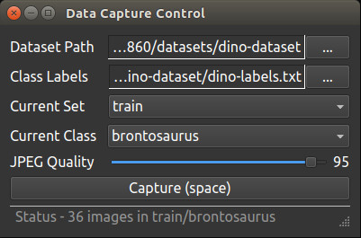

-----
# 카메라로 캡쳐한 영상 분류 학습 실습
<br><br><br><br>


# 분류 데이터 카메라 캡쳐

https://github.com/dusty-nv/jetson-inference/blob/master/docs/pytorch-collect.md 를 기반으로 함.

<br>

## 프로그램 위치

aarch64/bin/ 혹은  tools/ 혹은 /usr/local/bin/ 에 camera-capture가 있다.

<br>

## 실행 준비

docker에서 실행한다.

실행하기 전에 다음을 준비한다.

```bash
$ cd /jetson-inference/python/training/classification/data
$ mkdir thumb
$ echo "DOWN" >>  thumb/labels.txt
$ echo "UP" >>  thumb/labels.txt
```

다음을 실행하여 파일 내용을 확인.
```
$ cat thumb/labels.txt
DOWN
UP
```

<br>

## 실행

```bash
$ camera-capture

# 또는
$ camera-capture csi://0
```



<br>

## 옵션 설정

다음 옵션을 설정한다.

- Dataset Type : 'Classification'
- Dataset Path : 'jetson-inference/python/training/classification/data/thumb'
- Class Labels : 'jetson-inference/python/training/classification/data/thumb/labels.txt'

<br>

## 캡쳐

옵션을 설정하고

- Current Set : 'train'
- Current Class : 'UP'

엄지 손가락을 올리고 버튼 'Capture (space)'를 클릭한다. 클릭하는데로 jpg파일이 생성된다.
200개 캡쳐 한다.

<br>

옵션을 설정하고

- Current Set : 'train'
- Current Class : 'DOWN'

엄지 손가락을 내리고 버튼 'Capture (space)'를 클릭한다. 클릭하는데로 jpg파일이 생성된다.
200개 캡쳐 한다.

<br>

Current Set을 'val', 'test'로 하고 각각 'UP', 'DOWN'에 대하여 20개씩 캡쳐한다.


# 학습


## 학습 실행

```bash
$ cd /jetson-inference/python/training/classification
$ python3 train.py --model-dir=models/thumb data/thumb --epochs=35 --lr=0.001
```

모델 저장 위치는 

```bash
/jetson-inference/python/training/classification/
	models/thumb/
		checkpoint.pth.tar
		model_best.pth.tar
```

<br>

## ONNX 포멧으로 converting

```bash
$ python3 onnx_export.py --model-dir=models/thumb
```

/jetson-inference/python/training/classification/models/thumb/ 아래에 

resnet18.onnx 파일이 생성된다.

<br>

## 분류 실행

```bash
$ imagenet.py --model=models/thumb/resnet18.onnx --input_blob=input_0 --output_blob=output_0 --labels=data/thumb/labels.txt csi://0
```
<br>

## 전체 폴더 구조

```bash
# docker 안에서
/usr/local/bin/
	imagenet.py
	detectnet.py
	posenet.py

/jetson-inference/python/training/classification/
	train.py
	onnx_export.py
	data/
		thumb/
			labels.txt
			train/
				UP/
				DOWN/
	models/
		thumb/
			checkpoint.pth.tar
			model_best.pth.tar
			resnet18.onnx
```

data/thumb/labels.txt 내용

```bash
UP
DOWN
```

<br>
