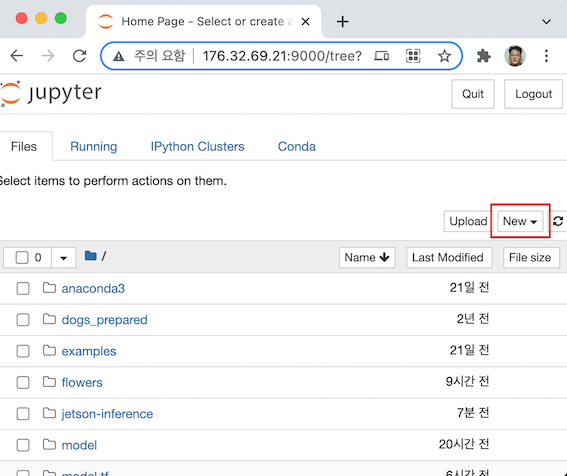

-----
# AWS 서버에서 물체 탐지 학습
<br><br><br><br>


# 환경 준비


## 서버 접속

각자 부여 받은 AWS의 jupyter로 접속. 본 문서에서는 http://176.32.69.21:9000 를 기준으로 한다.

상단 우측의 'new'를 클릭하고 'Terminal'을 선택

<br>


<br>

## Conda 실행

conda list에서 tensorflow2_p37 이름의 env가 있음을 확인
```
(python3) ubuntu@ip-172-31-19-226:~$ conda env list

# conda environments:#base                     /home/ubuntu/anaconda3
amazonei_mxnet_p36       /home/ubuntu/anaconda3/envs/amazonei_mxnet_p36aws_neuron_mxnet_p36     /home/ubuntu/anaconda3/envs/aws_neuron_mxnet_p36
aws_neuron_pytorch_p36     /home/ubuntu/anaconda3/envs/aws_neuron_pytorch_p36
aws_neuron_tensorflow_p36     /home/ubuntu/anaconda3/envs/aws_neuron_tensorflow_p36
mxnet_latest_p37         /home/ubuntu/anaconda3/envs/mxnet_latest_p37
mxnet_p36                /home/ubuntu/anaconda3/envs/mxnet_p36
python3               *  /home/ubuntu/anaconda3/envs/python3
pytorch_latest_p37       /home/ubuntu/anaconda3/envs/pytorch_latest_p37
pytorch_p37              /home/ubuntu/anaconda3/envs/pytorch_p37
tensorflow2_latest_p37     /home/ubuntu/anaconda3/envs/tensorflow2_latest_p37
tensorflow2_p37          /home/ubuntu/anaconda3/envs/tensorflow2_p37
tensorflow_p37           /home/ubuntu/anaconda3/envs/tensorflow_p37test                     /home/ubuntu/anaconda3/envs/test
```

conda activate로 환경에 들어간다.
```
(python3) ubuntu@ip-172-31-19-226:~$ conda activate pytorch_p37
(pytorch_p37) ubuntu@ip-172-31-19-226:~$
```

참고로 pytorch_p37에서 설치된 패키지는 [conda_env_pytorch_p37](conda_env_pytorch_p37)에서 볼 수 있다.


다음을 실행하여 pytorch 설치 확인
```
(pytorch_p37) ubuntu@ip-172-31-19-226:~$ python
Python 3.7.10 | packaged by conda-forge | (default, Feb 19 2021, 16:07:37)[GCC 9.3.0] on linux
Type "help", "copyright", "credits" or "license" for more information.
>>> import torch
>>> print(torch.__version__)
1.7.1
>>> exit()
```

<br>

## 프로젝트 다운로드

```bash
$ git clone --recurse-submodules https://github.com/dusty-nv/jetson-inference
$ cd jetson-inference
```

<br>


## 필요 라이브러리 설치

```bash
$ cd ~/jetson-inference/python/training/detection/ssd
$ pip3 install -v -r requirements.txt
```

<br>

## base 모델 다운로드

```
$ cd ~/jetson-inference/python/training/detection/ssd
$ wget https://nvidia.box.com/shared/static/djf5w54rjvpqocsiztzaandq1m3avr7c.pth -O models/mobilenet-v1-ssd-mp-0_675.pth

```
<br>

# 데이터 다운로드

```
$ cd ~/jetson-inference/python/training/detection/ssd/data
$ wget https://github.com/dhrim/jetson_image/raw/master/data/fruit.tar.gz
$ tar xvfz fruit.tar.gz
```

파일 구조는 다음과 같다.

```bash
data/fruit
    train/
        xxx.jpg
        ...
    validation/
        xxx.jpg
        ...
    test/
        xxx.jpg
        ...
    class-descriptions-boxable.csv   # 601개 전체 클래스 이름
    sub-train-annotation-bbox.csv       # 사용할 train 서브데이터 레이블링
    sub-validation-annotation-bbox.csv  # 사용할 validation 서브데이터 레이블링
    sub-test-annotation-bbox.csv        # 사용할 test 서브데이터 레이블링
    
    train-annotations-bbox.csv          # 전체 데이터. 사용 안함
    validation-annotations-bbox.csv     # 전체 데이터. 사용 안함
    test-annotations-bbox.csv           # 전체 데이터. 사용 안함

```

<br>

# 학습

## 학습 실행

```bash
$ cd ~/jetson-inference/python/training/detection/ssd/
$ python3 train_ssd.py --data=data/fruit --model-dir=models/fruit --batch-size=4 --epochs=100 --lr=0.001
```

epoch 당 8초, 35 epoch에 5분 소요된다.

모델 저장 위치는 

```bash
~/jetson-inference/python/training/detection/ssd/
    models/fruit/
	    labels.txt
	    mb1-ssd-Epoch-xx-Loss-x.xxx.pth
```

<br>

## ONNX 포멧으로 converting

```bash
$ python3 onnx_export.py --model-dir=models/fruit
```

~/jetson-inference/python/training/detection/models/fruit/ 아래에 
ssd-mobilenet.onnx 파일이 생성된다.

<br>

# 물체 탐지 실행

## 모델 다운로드

이 아래는 Jetson에서 실행한다. [docker](setup_by_docker.md)환경을 사용함.

<br>

Jetson에서 웹브라우저를 실행하고 AWS 서버의 Jupyter에 접속한다.

jetson-inference / python / training / detection / ssd / models / fruit 로 이동.

ssd-mobilenet.onnx를 체크.

상단의 'Download'를 클릭.


<br>

labels.txt를 체크

상단의 'Download'를 클릭.


<br>

탐색기를 열어서 다운로드 위치의 model.onnx와 labels.txt를 

jetson-inference / python / training / detection / ssd / models / fruit 로 카피.

<br>

## 데이터 다운로드

```
$ cd /jetson-inference/python/training/detection/ssd/data
$ wget https://github.com/dhrim/jetson_image/raw/master/data/fruit.tar.gz
$ tar xvfz fruit.tar.gz
```


## 실행

```bash
$ cd /jetson-inference/python/training/detection/ssd
$ mkdir -p data/fruit/result
$ detectnet.py --model=models/fruit/ssd-mobilenet.onnx --labels=models/fruit/labels.txt --input-blob=input_0 --output-cvg=scores --output-bbox=boxes data/fruit/test/ee8*.jpg data/fruit/result/result_%i.jpg
```

<br>

