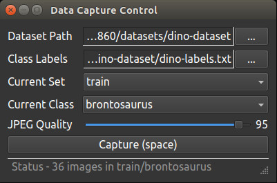

-----
# 커스텀 데이터 물체 탐지 학습 실습
<br><br><br><br>


# 물체 탐지 데이터 새로운 데이터 생성

https://github.com/dusty-nv/jetson-inference/blob/master/docs/pytorch-collect-detection.md 를 기반으로 함.

<br>

## 프로그램 위치

aarch64/bin/ 혹은  tools/ 혹은 /usr/local/bin/ 에 camera-capture가 있다.

<br>


## 실행 준비

실행하기 전에 다음을 준비한다.

```bash
$ cd /jetson-inference/python/training/detection/ssd/data
$ mkdir cups
$ echo "cup" > cups/labels.txt
```

classification 처럼 

detection  밑에 data 폴더가 아니라 

detection/ssd 밑에 data 폴더이다.

<br>

## 실행

```bash
$ camera-capture

# 또는
$ camera-capture csi://0
```



<br>

## 옵션 설정

다음 옵션을 설정한다.

- Dataset Type : 'Detection'
- Dataset Path : '/jetson-inference/python/training/detection/ssd/data/cups'
- Class Labels : '/jetson-inference/python/training/detection/ssd/data/cups/labels.txt'

<br>

## 캡쳐

옵션을 설정하고

- Current Set : 'train'

'Save on Unfreeze'를 체크한다.

버튼 'Freeze/Edit (space)'를 클릭한다. 

화면상에서 박스를 레이블링한다.

버튼 'Freeze/Edit (space)'를 클릭한다. 클릭하면 자동으로 파일로 저장된다.

<br>

Current Set을 'test'로 설정하고 최소 1개를 레이블링 한다.


<br>

### 생성된 데이터 파일들

다소 복잡하다.

```bash
new_data/
	labels.txt
	Annotations/
		20210903-231110.xml
		20210903-231112.xml
		...
	ImageSets/
		Main/
			train.txt
			trainval.txt
	JPEGImages/
		20210903-231110.jpg
		20210903-231112.jpg
		...
```

Annotasions/20210903-231110.xml 내용

```bash
<annotaion>
	<filename>20210903-231110.jpg</filename>
	<folder>cups</folder>
	<source>
		<database>cups</database>
		<annotation>custom</annotation>
		<image>custom</image>
	</source>
	<size>
		<width>1280</width>
		<height>720></height>
		<depth>3</depth>
	</size>
	<segmented>0</segmented>
	<object>
		<name>cup</name>
		<pose>unspecified</pose>
		<truncated>0</truncated>
		<difficult>0</difficult>
		<bndbox>
			<xmin>290</xmin>
			<ymin>60</ymin>
			<xmax>777</xmax>
			<ymax>356</ymax>
		</bndbox>
	</object>
</annotation>
```

ImageSets/Main/train.txt 내용

```bash
20210903-231110
20210903-231112
...
```

ImageSets/Main/trainval.txt 내용

```bash
20210903-231110
20210903-231112
...
```

## 학습
학습할 때는 train-ssd.py를 사용한다.
```
$ cd /jetson-inference/python/training/detection/ssd/
$ python train_ssd.py --dataset-type=voc --data=data/cups --model-dir=models/cups  --epochs=35 --lr=0.001
```

<br>

## ONNX 포멧으로 변환
```
$ python onnx_export.py --model-dir=models/cups
```

## 탐지 실행
```
$ detectnet.py --model=models/cups/ssd-mobilenet.onnx --labels=models/cups/labels.txt --input-blob=input_0 --output-cvg=scores --output-bbox=boxes csi://0
```


